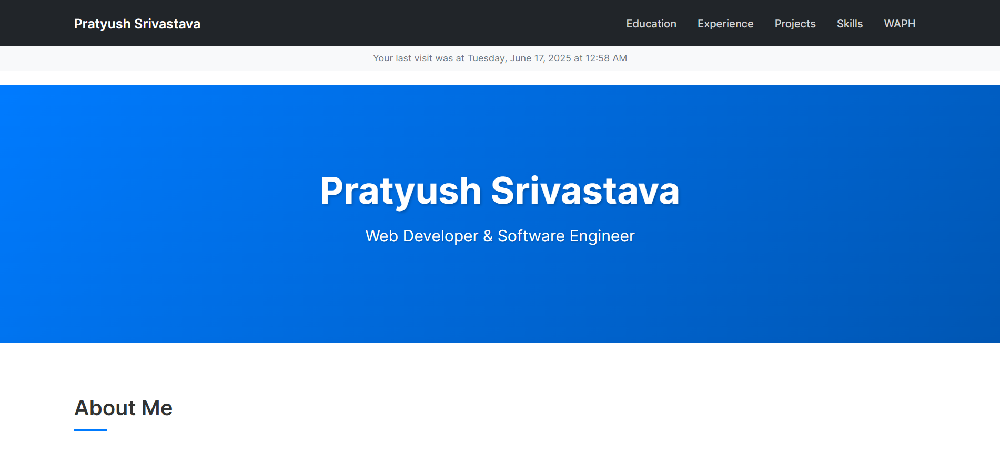
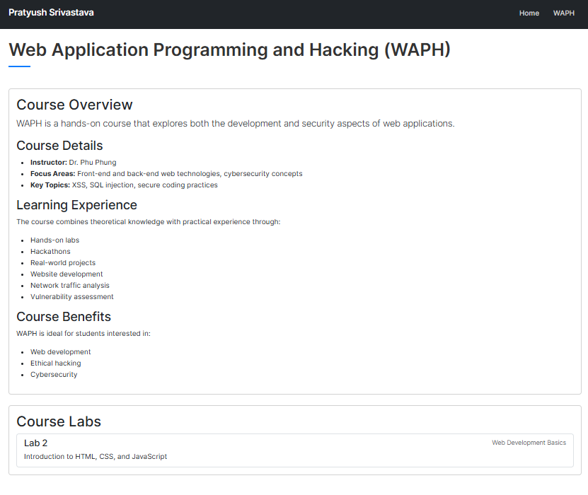
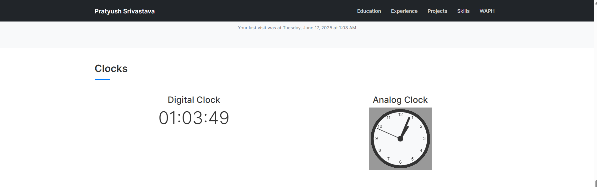
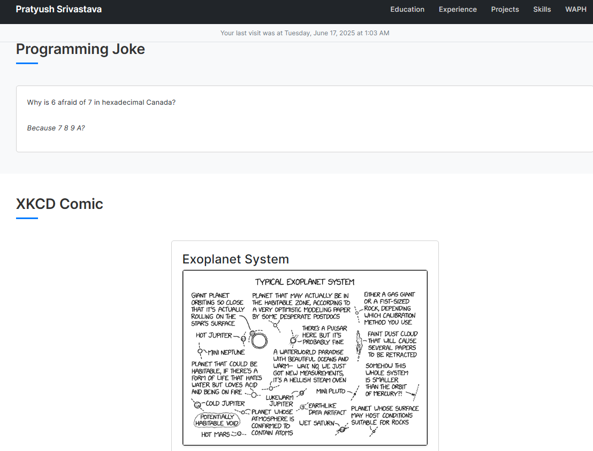
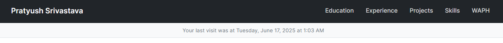

# Web Application Programming and Hacking

**Instructor:** Dr. Phu Phung

## Individual Project 1 – Professional Profile Website with API Integration

---

**Name:** Pratyush Srivastava  
**Email:** srivaspu@mail.uc.edu  

---

## Links

- **Deployed Website:** [https://pratysri.github.io](https://pratysri.github.io)
- **GitHub Repository:** [https://github.com/pratysri/pratysri.github.io](https://github.com/pratysri/pratysri.github.io)

---

## Overview

In this project, I created a personal professional profile website deployed on GitHub Pages. The site includes my resume, education, experience, skills, and interactive JavaScript components such as clocks and live APIs. I also integrated two public APIs and added localStorage-based tracking for first-time and returning visitors.

Through this assignment, I strengthened my understanding of front-end development, AJAX-based web services, JavaScript state handling, and GitHub-based deployment.

### 1. General Requirements

#### Personal Profile Website (25 pts)

_Screenshot: Main profile page with navigation and sections_

- Used custom Bootstrap-based theme with modern design
- Included my name, photo (150x150), contact info, education, experience, and skills
- Resume provided as downloadable PDF (`resume/resume.pdf`)

#### WAPH Course Page (5 pts)

_Screenshot: WAPH course page with lab summaries_

- Created `waph.html` with a summary of WAPH class, labs, and learning takeaways
- Linked this page from the main navigation

---

### 2. Non-Technical Requirements (20 pts)

#### CSS Template

_Screenshot: Website on mobile device_

- Used Bootstrap via CDN for styling
- Applied a clean, mobile-friendly layout with custom color scheme
- Implemented smooth scrolling and fade-in animations

#### Page Tracker

_Screenshot: Flag counter widget_

- Embedded [Flag Counter](https://flagcounter.com) to count visitors

---

### 3. Technical Requirements (50 pts)

#### JavaScript Features (20 pts)

_Screenshot: Digital and analog clocks_

- **Digital Clock:** Added using `setInterval()` to update current time
- **Analog Clock:** Built with Canvas and JavaScript drawing functions
- **Dark Mode Toggle:** Implemented theme switching with localStorage persistence
- **Last Visit Tracking:** Shows last visit time using localStorage

#### API Integration (20 pts)

_Screenshot: Joke API and XKCD comic sections_

- **Joke API:** Used `https://v2.jokeapi.dev/joke/Programming?safe-mode` to fetch programming jokes
- **XKCD Comic:** Fetched and displayed latest XKCD comic using `https://xkcd.vercel.app/?comic=latest`
- **Disclaimer:** Displayed under both API sections to indicate third-party content

#### Visit Tracking (10 pts)

_Screenshot: Last visit display_

- Shows last visit time at the top of the page
- Uses localStorage to persist visit information
- Updates automatically on each page load

---

## Final Thoughts

This project helped me integrate multiple frontend concepts including dynamic JavaScript behavior, public web APIs, and persistent browser state. It was also a valuable experience in deploying a site publicly using GitHub Pages, making it suitable for real-world professional use.
