# WAPH – Web Application Programming and Hacking

## Instructor: Dr. Phu Phung

# Lab 2 – Front-end Web Development

---

## Student Information
**Name:** Pratyush Srivastava  
**Email:** srivaspu@mail.uc.edu  

**GitHub Repository:** [https://github.com/pratysri/waph-pratysri/tree/main/labs/lab2](https://github.com/pratysri/waph-pratysri/tree/main/labs/lab2)

---

## Overview
This lab focused on front-end web development techniques involving HTML, CSS, JavaScript, AJAX (both native and jQuery-based), and integration with external web APIs. The lab was divided into two main tasks: building a foundational webpage with dynamic features and progressively enhancing it with interactivity through asynchronous communication and external data sources.

---

## Task 1: Basic HTML with Forms and JavaScript

### a. HTML (5 pts)
- Created `waph-pratysri.html` as the main lab webpage.
- Added the following HTML elements:
  - My name, email, and headshot image.
  - Two `<form>` elements with GET and POST methods submitting to `echo.php`.
  - Used `<h1>`, `
`, ``, `<input>`, `<form>`, and ` ` tags appropriately.

**Figure 1:** Full page layout with header, image, and forms.  
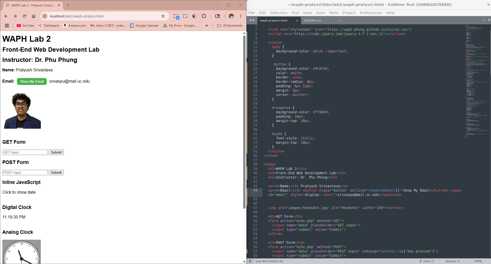

### b. JavaScript (15 pts)

#### i. Inline JavaScript – Show Date/Time (2 pts)
- Used `onclick` event on a `
` to show the current date and time using `Date()`.

**Figure 2:** Before and after clicking to show date/time.  
  
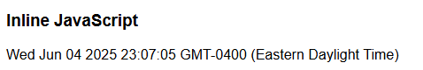

#### ii. Key Press Logger (2 pts)
- Attached `onkeyup` event to an `<input>` element to log key presses in the browser console.

**Figure 3:** Developer console showing key press logs.  
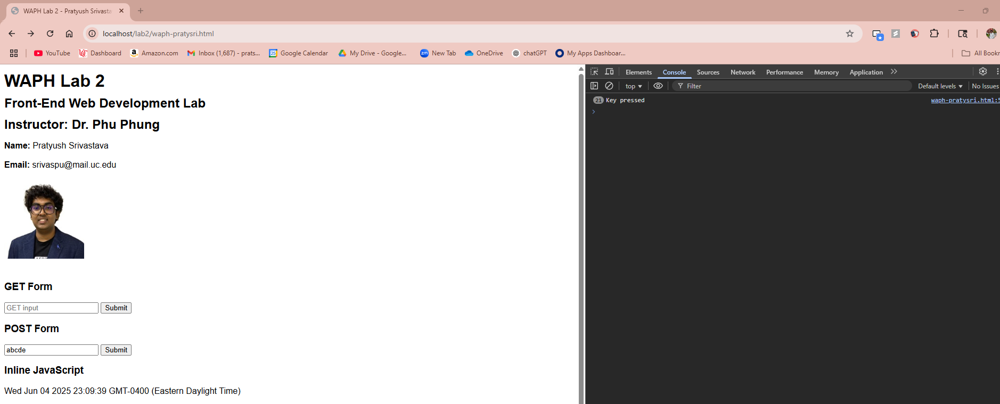

#### iii. Digital Clock (2 pts)
- Used `setInterval()` and `Date()` object in a `<script>` tag to create a live updating digital clock.

**Figure 4:** Digital clock displayed on the webpage.  
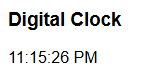

#### iv. Show/Hide Email (4 pts)
- Created `email.js` as an external JavaScript file.
- Defined a function to toggle visibility of an email address when clicked.

**Figure 5:** Toggling visibility of email using external JS.  
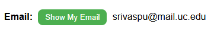

#### v. Analog Clock (5 pts)
- Embedded an external JS script (`clock.js`) to render an analog clock inside a `<canvas>`.

**Figure 6:** Canvas displaying an analog clock.  
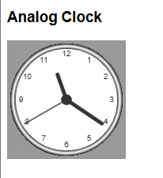

**Figure 7:** Screenshot showing the complete Task 1 functionality.  
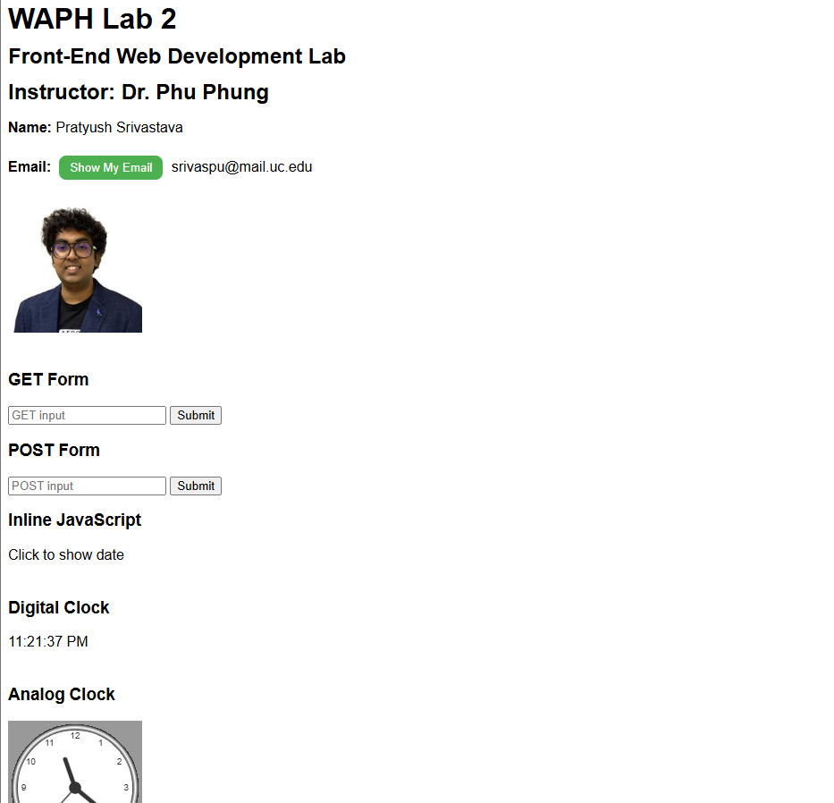

---

## Task 2: AJAX, CSS, jQuery, and Web API Integration

### a. AJAX with XMLHttpRequest (7.5 pts)
- Added a new `<input>`, `<button>`, and `
` for AJAX communication.
- Implemented a `getEcho()` function using `XMLHttpRequest`.
- Sent input to `echo.php` via GET and displayed response in `#response`.
- Verified request and response using browser Developer Tools.

**Figure 8:** AJAX input and response block, with network tab showing the request.  

### b. CSS Styling (7.5 pts)
- Applied multiple styles:
  - **Inline CSS** to change heading color.
  - **Internal CSS** within `<style>` tag to style buttons and the response area.
  - **External CSS** by linking to `https://waph-phung.github.io/style2.css`.

**Figure 9:** Green buttons and orange response box styled using CSS.  
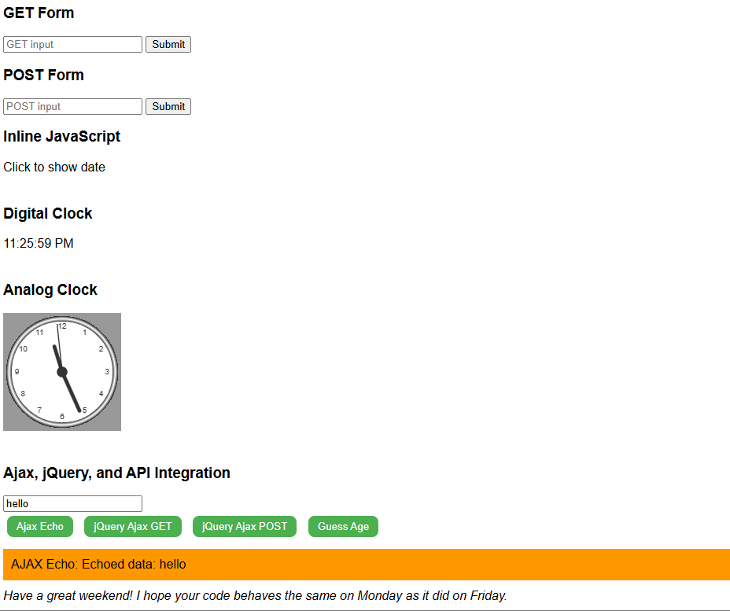

### c. jQuery AJAX (5 pts)
- Loaded jQuery via CDN.
- Used `$.get()` and `$.post()` methods to send data to `echo.php`.
- Displayed the server’s response inside `#response` without page reload.

**Figure 10:** Output from jQuery GET request.  

**Figure 11:** Output from jQuery POST request.  
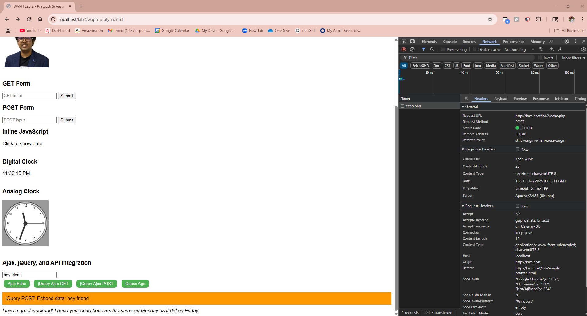

### d. Web API Integration (10 pts)

#### i. JokeAPI (5 pts)
- Used jQuery to send a GET request to JokeAPI: `https://v2.jokeapi.dev/joke/Programming?type=single`
- Extracted the joke and displayed it in the page on load.

**Figure 12:** Displayed joke fetched from external API.  
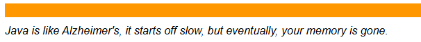

#### ii. Agify API using Fetch (5 pts)
- Used the Fetch API with `async/await` to send input to `https://api.agify.io/?name=<input>`.
- Parsed and rendered the predicted age based on name.

**Figure 13:** Age prediction shown from Agify API.  
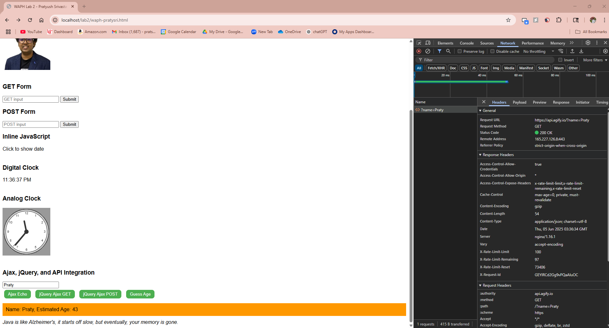

---

## Files Created and Used
- `waph-pratysri.html` – HTML file containing structure and all JS integrations.
- `email.js` – External JavaScript to toggle email visibility.
- `echo.php` – PHP backend script reused from Lab 1 for form and AJAX testing.
- `clock.js` – Remote external JS used to display analog clock.
- `images/headshot.jpg` – Image file for student profile.

---

## Conclusion
This lab solidified my understanding of core front-end web technologies including DOM manipulation, dynamic content rendering, and asynchronous data communication. I gained practical experience integrating multiple APIs, handling events, and styling webpages using various CSS techniques.

---

*End of Report*